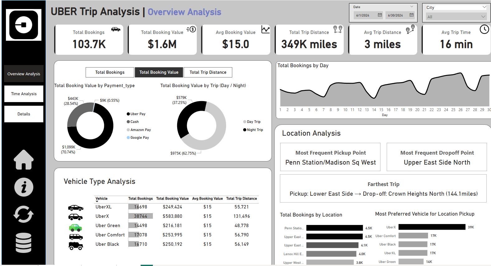
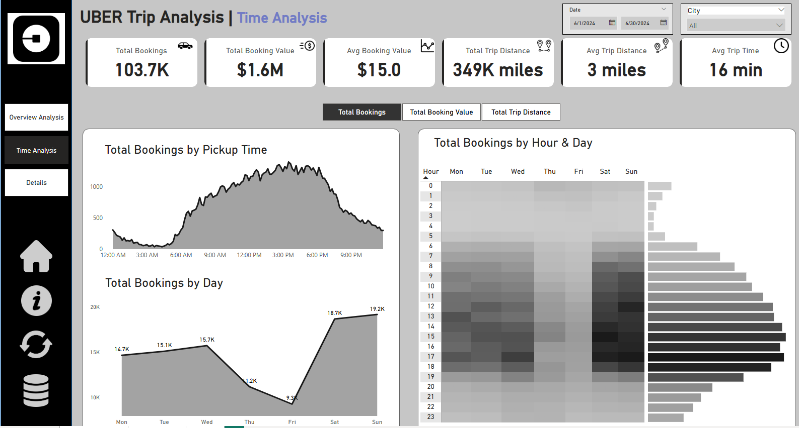
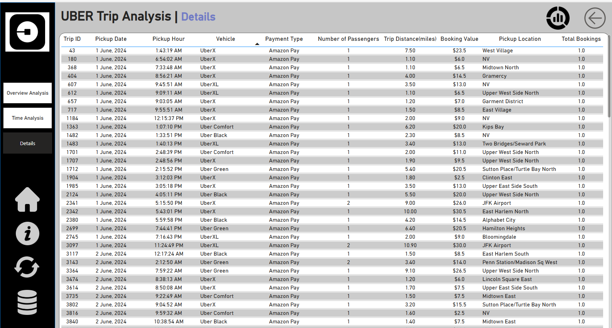

# 🚖 UBER Trip Analysis – Power BI Dashboard

This repository contains an interactive Power BI project for analyzing UBER trip data. The dashboard offers insights into booking trends, vehicle types, payment methods, trip times, and location-specific behaviors. It enables stakeholders to make data-driven decisions based on trip performance and customer preferences.

---

## 📊 Dashboard Overview

### 🔹 Overview Analysis
- **Total Bookings**: 103.7K  
- **Total Booking Value**: $1.6M  
- **Average Booking Value**: $15  
- **Total Trip Distance**: 349K miles  
- **Average Trip Distance**: 3 miles  
- **Average Trip Time**: 16 minutes  

#### Key Visuals:
- **Payment Type Breakdown**: Uber Pay, Cash, Amazon Pay, Google Pay  
- **Day vs Night Trip Revenue**  
- **Bookings Trend by Day**  
- **Vehicle Type Analysis**: Includes UberX, UberXL, Uber Comfort, Uber Black, and Uber Green  
- **Frequent Pickup/Dropoff Locations**  
- **Longest Recorded Trip**: Lower East Side → Crown Heights North (144.1 miles)  

---

### 🔹 Time Analysis
- **Booking Distribution by Pickup Time**  
- **Heatmap of Bookings by Hour and Day**  
- **Daily Booking Trends**: Highest on Sunday (19.2K) and Saturday (18.7K)

---

### 🔹 Detailed Trip Records
Tabular view of:
- Trip ID  
- Pickup Date & Time  
- Vehicle Type  
- Payment Method  
- Trip Distance  
- Booking Value  
- Pickup Location  

---

## 📌 Insights & Highlights

- UberX is the most used vehicle with 38.7K bookings.  
- Uber Pay accounts for over 70% of total booking value.  
- Weekends show significantly higher booking volumes.  
- Peak booking times occur between 12 PM to 6 PM.  

---

## 🛠️ Tools & Technologies

- **Power BI**  
- Data preprocessing (if any) in **Excel/Power Query**  
- Custom visuals and DAX measures  

---

## 📸 Screenshots

